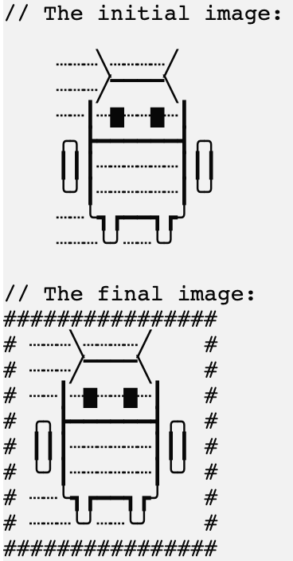

В этом задании мы реализуем один из фильтров.

### Задание

Реализуйте функцию `applyBordersFilter`. Для символа границы используйте предопределённую переменную `borderSymbol`, которая хранит `#`:
```kotlin
println(borderSymbol) // #
```

<div class="hint" title="Нажмите, чтобы увидеть пример работы функции applyBordersFilter">

Вот пример работы функции:
<p>
    
</p>
</div>

Чтобы сделать картинку красивее, добавьте разделитель между картинкой и границей. Для разделителя используйте предопределённую переменную `separator`, которая хранит пробел.
```kotlin
println("Это значение переменной separator: $separator.") // Это значение переменной separator:  .
```

**Обратите внимание, что картинка может не быть квадратной, что означает, что ширина разных строк в картинке может варьироваться.**
Другими словами, вам нужно дополнить более короткие строки `separator` так, чтобы изображение стало квадратным. Чтобы получить ширину картинки, вы можете использовать предопределённую функцию `getPictureWidth`, которая возвращает максимальную длину всех строк картинки.

<div class="hint" title="Нажмите, чтобы увидеть пример работы функции getPictureWidth">

```kotlin
val pictureWidth = getPictureWidth(picture) // вычисляет самую длинную строку в картинке и возвращает её длину
```

Кроме того, проект уже хранит переменную `newLineSymbol`, которую можно использовать для добавления новых строк между вновь сгенерированными строками изображения, например:
```kotlin
val line1 = "#######"
val line2 = "#######"

val line3 = "$line1$newLineSymbol$line2"
println(line3)
```

Результат будет:
```text
#######
#######
```
</div>

Если у вас возникнут трудности, **подсказки помогут вам решить это задание**.

----

### Подсказки

<div class="hint" title="Нажмите, чтобы увидеть несколько примеров работы функции applyBordersFilter">

Первый пример:


Второй пример:


</div>

<div class="hint" title="Нажмите, чтобы узнать, как запустить функцию applyBordersFilter с заранее определёнными картинками">

Чтобы проверить, как работает ваша функция, вы можете запустить её в <code>main</code>, передав одну из заранее определённых картинок:

```kotlin
fun main() {
  applyFilter(simba, "borders")   // пример с картинкой simba
  applyFilter(monkey, "borders")  // пример с картинкой monkey
  applyFilter(android, "borders") // пример с картинкой android (эта картинка имеет строки разной длины)
}
```
</div>

<div class="hint" title="Нажмите, чтобы получить подсказку о том, как вычислить длину верхней и нижней границ нового изображения">

Длина верхней и нижней границ будет на 4 символа больше, чем ширина исходного изображения, так как мы добавляем 
<code>borderSymbol</code> и <code>separator</code> по обеим сторонам изображения.
</div>

<div class="hint" title="Нажмите, чтобы узнать, как самостоятельно реализовать функцию getPictureWidth">

  Если хотите, можете попробовать самостоятельно реализовать свою версию функции `getPictureWidth`: 
  разделите картинку, используя функцию <a href="https://kotlinlang.org/api/latest/jvm/stdlib/kotlin.text/lines.html">`lines`</a>, 
  а затем используйте функцию <a href="https://kotlinlang.org/api/latest/jvm/stdlib/kotlin.text/max-of-or-null.html">`maxOfOrNull`</a>, 
  чтобы вычислить максимальную длину строк картинки.   
</div>