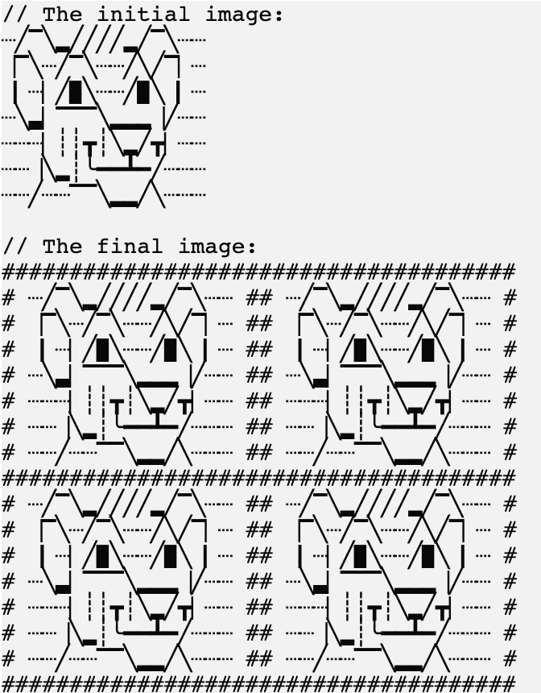

Давайте реализуем второй фильтр!

### Задание

Реализуйте функцию `applySquaredFilter`. Для символа границы используйте предопределенную переменную `borderSymbol`, которая хранит `#`:
```kotlin
println(borderSymbol) // #
```

<div class="hint" title="Click me to see an example of the applySquaredFilter function's work">

Вот пример работы функции:
<p>
    
</p>
</div>

Чтобы сделать изображение красивее, добавьте разделитель между изображением и границей. Для разделителя используйте предопределенную переменную `separator`, которая хранит пробел.
```kotlin
println("Это значение из переменной separator: $separator.") // Это значение из переменной separator:  .
```

**Обратите внимание, что изображение может не быть квадратным, это значит, что ширина разных строк в изображении может отличаться.**
Другими словами, вам нужно дополнить более короткие строки с помощью `separator`, чтобы сделать изображение квадратным. Чтобы получить ширину изображения, вы можете использовать предопределенную функцию `getPictureWidth`,
которая возвращает максимальную длину всех строк изображения.

<div class="hint" title="Click me to see an example of the getPictureWidth function's work">

```kotlin
val pictureWidth = getPictureWidth(picture) // вычисляет самую длинную строку в изображении и возвращает ее длину
```

Кроме того, в проекте уже хранится переменная `newLineSymbol`, которую можно использовать для добавления новых строк между вновь сгенерированными строками изображения, например:
```kotlin
val line1 = "#######"
val line2 = "#######"

val line3 = "$line1$newLineSymbol$line2"
println(line3)
```

Результат будет:
```text
#######
#######
```
</div>

Если у вас возникнут трудности, **подсказки помогут вам решить это задание**.

----

### Подсказки

<div class="hint" title="Click me to see several examples of how the applySquaredFilter function should work">

Первый пример:


Второй пример:

</div>

<div class="hint" title="Click me to learn how to run the applySquaredFilter function with predefined pictures">

Чтобы проверить, как работает ваша функция, вы можете запустить ее в <code>main</code>, передав одну из предопределенных картинок:

```kotlin
fun main() {
  applyFilter(simba, "squared")   // пример с картинкой симбы
  applyFilter(monkey, "squared")  // пример с картинкой обезьяны
  applyFilter(android, "squared") // пример с картинкой андроида (эта картинка имеет строки разной длины)
}
```
</div>

<div class="hint" title="Click me to learn the main idea of the algorithm">

Вы можете использовать функцию `applyBordersFilter` для добавления границ. Затем создайте два экземпляра `StringBuilder` — один для верхней части и другой для нижней. Продолжайте заполнять их, построчно.
</div>

<div class="hint" title="Click me to learn how to implement the getPictureWidth function on your own">

Если хотите, можете попробовать реализовать свою собственную версию функции `getPictureWidth`: разделите изображение с помощью функции <a href="https://kotlinlang.org/api/latest/jvm/stdlib/kotlin.text/lines.html">`lines`</a> и затем используйте функцию <a href="https://kotlinlang.org/api/latest/jvm/stdlib/kotlin.text/max-of-or-null.html">`maxOfOrNull`</a> для вычисления максимальной длины всех строк изображения.
</div>