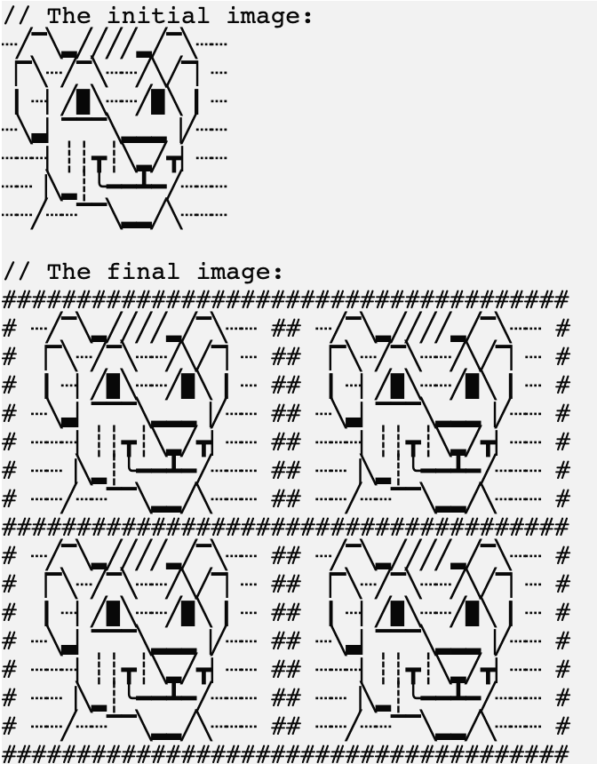

В этом задании мы определим _сигнатуры_ для нескольких функций и реализуем одну из них.

### Задача

Добавьте несколько функций в игру:

- _applyBordersFilter_, которая принимает один строковый аргумент, `picture`,
  и возвращает новое изображение с примененным фильтром.
  Пока вам не нужно полностью реализовывать эту функцию. Вместо этого достаточно использовать функцию `TODO`
  в качестве заглушки для будущей реализации.
  Мы реализуем эту функцию при решении последующих задач.

<div class="hint" title="Нажмите, чтобы увидеть сигнатуру функции applyBordersFilter">

Сигнатура функции:
```kotlin
fun applyBordersFilter(picture: String): String
```
</div>

<div class="hint" title="Нажмите, чтобы увидеть пример фильтра границ после завершения проекта">

Пример этого фильтра:
<p>
    
</p>

</div>

- _applySquaredFilter_, которая принимает один строковый аргумент, `picture`,
  и возвращает новое изображение с примененным фильтром.
  Пока вам не нужно полностью реализовывать эту функцию. Вместо этого достаточно использовать функцию `TODO`
  в качестве заглушки для будущей реализации.
  Мы реализуем эту функцию при решении последующих задач.

<div class="hint" title="Нажмите, чтобы увидеть сигнатуру функции applySquaredFilter">

Сигнатура функции:
```kotlin
fun applySquaredFilter(picture: String): String
```
</div>

<div class="hint" title="Нажмите, чтобы увидеть пример квадратичного фильтра после завершения проекта">

Пример этого фильтра:
<p>
    
</p>

</div>