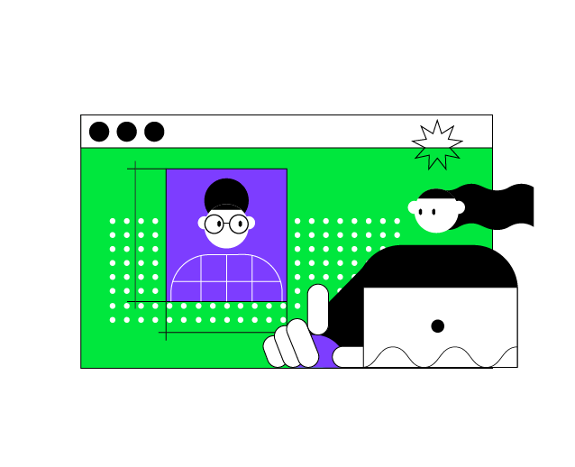

Этот урок сосредоточен на темах, которые вы изучили на предыдущем занятии. Главное отличие заключается в том, что итоговый проект не будет разделен на промежуточные этапы, и вы можете попробовать реализовать его с нуля самостоятельно. Мы не сомневаемся, что у вас все получится!

----

<p align="center">
    
</p>

### описание проекта

Проект этого урока — **Генератор узоров**. Цель этого проекта — создать приложение для автоматической генерации изображений символов заданного размера и узора.

Во-первых, вам нужно спросить у пользователя:
```text
Вы хотите использовать предопределенный узор или собственный?
Пожалуйста, введите 'yes' для предопределенного узора или 'no' для собственного.
```

Вам нужно обработать ответ пользователя и задать вопрос снова, если ответ некорректен. Если пользователь хочет использовать собственный узор, просто попросите его ввести его. Если пользователь хочет использовать предопределенный узор, попросите его выбрать один из предопределенных узоров. Вы можете получить список всех узоров, вызвав уже определенную функцию `allPatterns`.

Во-вторых, спросите у пользователя, какой генератор выбрать: `canvas` или `canvasGaps`. И наконец, попросите пользователя ввести `width` и `height` генерируемого изображения.

### пример проекта

