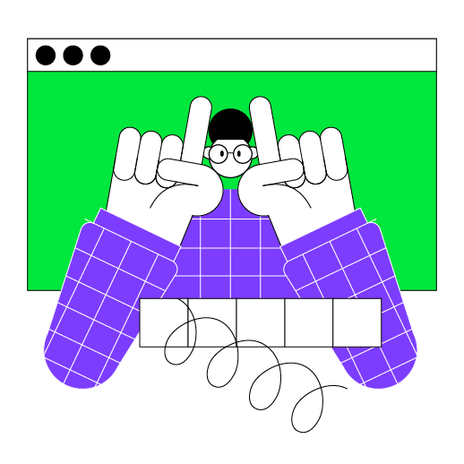

Поздравляю! Базовая версия игры **Быки и коровы (Mastermind)** готова!
Однако, играть не интересно, если скрытое слово всегда одинаковое, не так ли?

    

### описание проекта

Вы уже реализовали базовую версию игры **Быки и коровы (Mastermind)**.
В этом проекте мы введем еще две концепции и улучшим игру, добавив генерацию
случайного секрета и проверки вводов пользователя.

Мы поместили стандартную реализацию игры в файл `Main.kt` из последнего шага предыдущего задания.
Вы можете заменить её своей собственной реализацией.

### темы урока

- функция `random`;
- генерация случайных строк;
- встроенные функции для работы с коллекцией List.

### пример проекта

Чтобы подогнать картинку, были добавлены дополнительные разрывы строк.
Вам не нужно их добавлять при решении задачи.