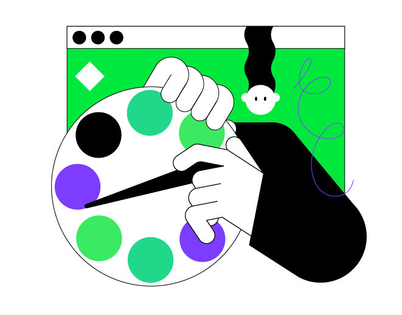

    

### Описание проекта

Проект этого урока - **Перевертыш истории**.
Цель этой игры - задать пользователю несколько фиктивных вопросов,
запомнить ответы, а затем раскрыть настоящие вопросы, чтобы построить забавную историю из этих ответов.

### Темы урока

- точка входа в программу на Kotlin;
- встроенные функции для вывода в консоль;
- переменные;
- встроенные функции для считывания пользовательского ввода.

### Пример проекта

