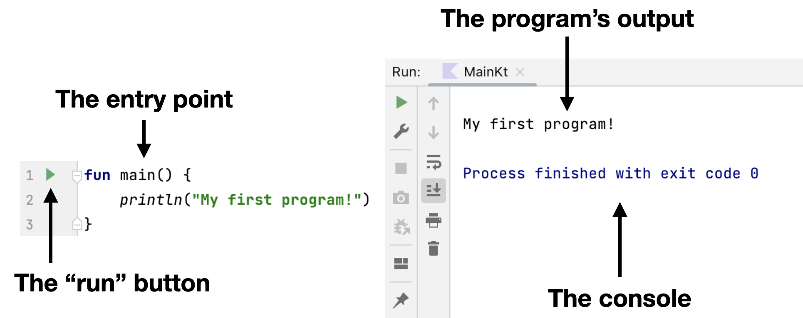

Каждая программа, написанная на любом языке программирования, имеет **точку входа**. Как правило, это специальный раздел в программе, который управляет всеми последующими операциями.

В Kotlin [точкой входа](https://kotlinlang.org/docs/basic-syntax.html#program-entry-point) является специальная функция `main`, которая выглядит следующим образом:
```kotlin
fun main() {
    // Здесь находится код
}
```

Все, что происходит _внутри_ функции (между фигурными скобками), выполняется во время работы программы. Эта функция может располагаться в _любом_ файле вашего проекта; вы можете даже добавить _несколько_ функций `main` в один проект. В последнем случае вы можете выбрать, какую точку входа запускать.

Чтобы `запустить` программу, следует нажать на **зелёный треугольник** рядом с функцией `main`, и тогда результат программы отобразится в _консоле_ внутри IDE:

