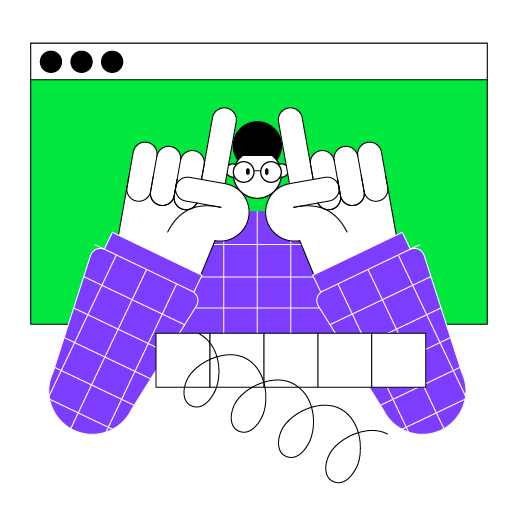

Вы уже изучили самые базовые конструкции программирования. Этот урок нацелен на то, чтобы помочь вам освоить немного более сложные конструкции, такие как циклы, условные операторы и другое.

----

    

### Описание проекта

Проект этого урока — **Быки и коровы (Mastermind)**. Это популярная детская игра на угадывание скрытого слова. Основная цель игры — угадать скрытое слово. С каждой попыткой игрок получает количество точных совпадений (правильные буквы на правильной позиции) и частичных совпадений (правильные буквы на неправильной позиции). Например, при ACEB как скрытом слове, догадка BCDF даст 1 полное совпадение (C) и 1 частичное совпадение (B). Подробные правила можно найти [здесь](https://en.wikipedia.org/wiki/Bulls_and_Cows).

В этом уроке проект будет разделен на две части:
- Сначала вы создадите прототип игры, который может играть с пользователем, но скрытое слово всегда будет одним и тем же.
- Второй шаг будет добавление случайно сгенерированного скрытого слова, а также возможность безопасного взаимодействия с пользователем, например, обработка ввода пользователя.

### Темы урока

- различные типы переменных;
- функции;
- циклы;
- диапазоны;
- выражения `if`;
- логические операции `or` и `and`;
- основные факты о коллекции List, встроенные функции для работы с ней, основные факты о лямбда-выражениях в этих встроенных функциях.

### Пример проекта

Для того чтобы картинка соответствовала, были добавлены дополнительные разрывы строк. Вам не нужно добавлять их при решении задачи.